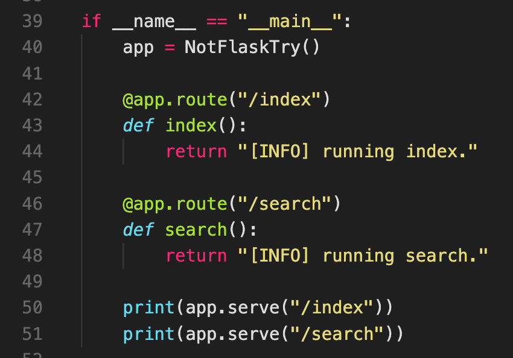

# not-flask-skeleton

Experimenting with ways to run Jina apps locally, maybe eventually wih Typer. More just for practice and thinking about the design patterns that power modern python software.

    

